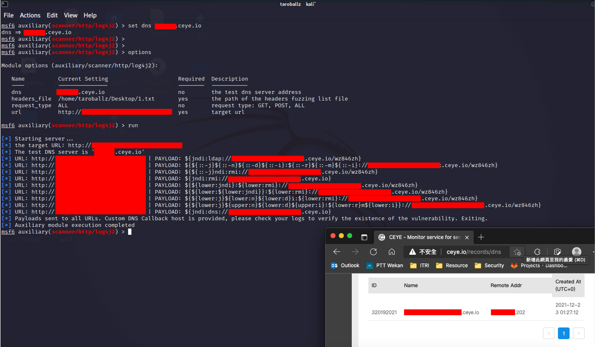
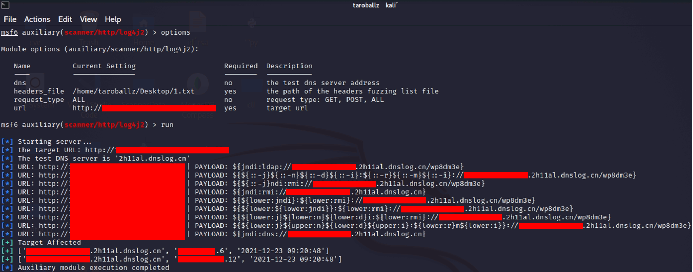

# CVE-2021-44228-log4jVulnScanner-metasploit
open detection and scanning tool for discovering and fuzzing for Log4J RCE CVE-2021-44228 vulnerability

# preparation POC
```cmd
git clone https://github.com/TaroballzChen/CVE-2021-44228-log4jVulnScanner-metasploit
cd CVE-2021-44228-log4jVulnScanner-metasploit
mkdir -p ~/.msf4/modules/auxiliary/scanner/http
cp log4j2.py ~/.msf4/modules/auxiliary/scanner/http/
chmod +x ~/.msf4/modules/auxiliary/scanner/http/log4j2.py
msfconsole
```

# POC usage
```text
use auxiliary/scanner/http/log4j2
set url <vuln url>
set dns <the self dns address or leave blank for dnslog.cn>
set request_type <GET, POST, ALL>
set headers_file <the path of http header param dictionary>
```

# result



# Reference
- https://github.com/fullhunt/log4j-scan
